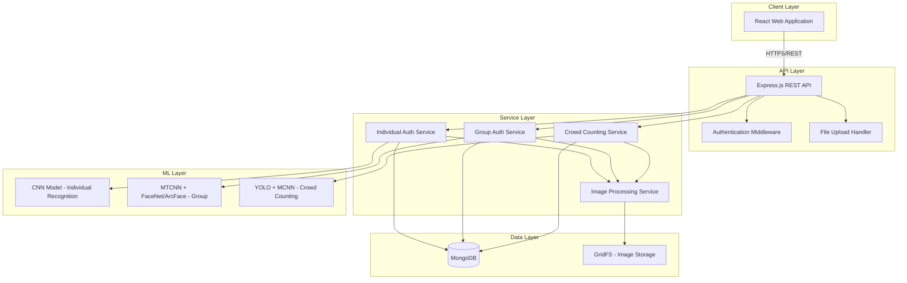
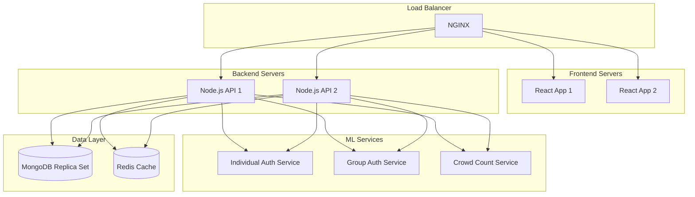

# Design Document

## Overview

The Multi-Level Face Recognition and Crowd Analysis System is a full-stack application built on the MERN stack (MongoDB, Express.js, React, Node.js) integrated with deep learning models for face recognition and crowd analysis. The system provides three primary capabilities through a unified web interface: individual authentication, group authentication, and large gathering face counting.

The architecture follows a microservices-inspired approach with clear separation between the web frontend, REST API backend, deep learning inference services, and data storage layer. This design ensures scalability, maintainability, and the ability to independently update or replace components.

## Architecture

### High-Level Architecture



### Technology Stack

**Frontend:**
- React 18.x with functional components and hooks
- Material-UI (MUI) for UI components
- Axios for HTTP requests
- React Router for navigation
- Webcam integration using react-webcam

**Backend:**
- Node.js 18.x LTS
- Express.js 4.x for REST API
- Mongoose for MongoDB ODM
- Multer for file uploads
- JWT for authentication
- Bcrypt for password hashing

**Deep Learning:**
- Python 3.9+ for ML services
- TensorFlow 2.x / PyTorch for model implementation
- OpenCV for image preprocessing
- Flask/FastAPI for ML model serving
- MTCNN for face detection
- FaceNet or ArcFace for feature extraction
- YOLO v5/v8 for real-time detection
- Custom MCNN implementation for crowd counting

**Database:**
- MongoDB 6.x for primary data storage
- GridFS for large image file storage
- Redis for caching (optional performance enhancement)

**Infrastructure:**
- Docker for containerization
- NGINX as reverse proxy
- PM2 for Node.js process management

## Components and Interfaces

### 1. Frontend Components

#### 1.1 Main Application Structure

```
src/
├── components/
│   ├── common/
│   │   ├── Header.jsx
│   │   ├── Navigation.jsx
│   │   ├── ImageUploader.jsx
│   │   └── WebcamCapture.jsx
│   ├── auth/
│   │   ├── Login.jsx
│   │   ├── Register.jsx
│   │   └── ProtectedRoute.jsx
│   ├── individual/
│   │   ├── IndividualRegistration.jsx
│   │   ├── IndividualAuthentication.jsx
│   │   └── ResultDisplay.jsx
│   ├── group/
│   │   ├── GroupAuthentication.jsx
│   │   ├── AttendanceReport.jsx
│   │   └── AttendanceHistory.jsx
│   └── crowd/
│       ├── CrowdCounter.jsx
│       ├── DensityHeatmap.jsx
│       └── RealTimeStream.jsx
├── services/
│   ├── api.js
│   ├── authService.js
│   └── imageService.js
├── context/
│   └── AuthContext.jsx
├── utils/
│   └── validators.js
└── App.jsx
```

#### 1.2 Key Component Interfaces

**ImageUploader Component:**
- Props: `onImageSelect`, `maxSize`, `acceptedFormats`
- Events: `onUploadSuccess`, `onUploadError`
- Validates file size (max 10MB) and format (JPEG, PNG)

**WebcamCapture Component:**
- Props: `onCapture`, `resolution`
- Captures images from user's webcam
- Supports multiple captures for registration

**ResultDisplay Component:**
- Props: `result`, `confidenceScore`, `processingTime`
- Displays authentication results with visual feedback

### 2. Backend API Endpoints

#### 2.1 Authentication Endpoints

```
POST /api/auth/register
- Body: { username, email, password, role }
- Response: { token, user }

POST /api/auth/login
- Body: { email, password }
- Response: { token, user }

GET /api/auth/verify
- Headers: Authorization: Bearer <token>
- Response: { valid, user }
```

#### 2.2 Individual Authentication Endpoints

```
POST /api/individual/register
- Headers: Authorization: Bearer <token>
- Body: FormData with multiple images and metadata
- Response: { userId, faceId, message }

POST /api/individual/authenticate
- Headers: Authorization: Bearer <token>
- Body: FormData with single image
- Response: { authenticated, userId, confidence, processingTime }

GET /api/individual/:userId
- Headers: Authorization: Bearer <token>
- Response: { user, registeredFaces, metadata }

DELETE /api/individual/:userId
- Headers: Authorization: Bearer <token>
- Response: { success, message }
```

#### 2.3 Group Authentication Endpoints

```
POST /api/group/authenticate
- Headers: Authorization: Bearer <token>
- Body: FormData with group image and eventId
- Response: { 
    totalFaces, 
    identified: [{ userId, name, confidence }],
    unidentified: number,
    processingTime 
  }

GET /api/group/attendance/:eventId
- Headers: Authorization: Bearer <token>
- Response: { event, attendees, timestamp, imageUrl }

GET /api/group/attendance/history
- Headers: Authorization: Bearer <token>
- Query: ?startDate=&endDate=&userId=
- Response: { records: [...] }
```

#### 2.4 Crowd Counting Endpoints

```
POST /api/crowd/count
- Headers: Authorization: Bearer <token>
- Body: FormData with crowd image
- Response: { 
    faceCount, 
    accuracy, 
    densityMap, 
    processingTime 
  }

POST /api/crowd/stream
- Headers: Authorization: Bearer <token>
- WebSocket connection for real-time video processing
- Response: Stream of face count updates
```

### 3. Service Layer Components

#### 3.1 Individual Authentication Service

**Responsibilities:**
- Coordinate registration workflow
- Manage authentication requests
- Interface with CNN model
- Handle database operations

**Key Methods:**
```javascript
class IndividualAuthService {
  async registerUser(userId, images, metadata)
  async authenticateUser(image)
  async getUserProfile(userId)
  async deleteUser(userId)
  async updateFaceData(userId, newImages)
}
```

#### 3.2 Group Authentication Service

**Responsibilities:**
- Process group images
- Coordinate face detection and recognition
- Generate attendance reports
- Manage event data

**Key Methods:**
```javascript
class GroupAuthService {
  async authenticateGroup(image, eventId)
  async createAttendanceRecord(eventId, attendees)
  async getAttendanceHistory(filters)
  async generateReport(eventId)
}
```

#### 3.3 Crowd Counting Service

**Responsibilities:**
- Process crowd images/video
- Generate face counts
- Create density heatmaps
- Handle real-time streaming

**Key Methods:**
```javascript
class CrowdCountingService {
  async countFaces(image)
  async generateDensityMap(image)
  async processVideoStream(streamUrl)
  async getHistoricalData(filters)
}
```

#### 3.4 Image Processing Service

**Responsibilities:**
- Image validation and preprocessing
- Format conversion
- Resize and normalization
- Storage management

**Key Methods:**
```javascript
class ImageProcessingService {
  async validateImage(file)
  async preprocessImage(image, targetSize)
  async saveToGridFS(image, metadata)
  async retrieveFromGridFS(imageId)
  async deleteImage(imageId)
}
```

### 4. Deep Learning Model Integration

#### 4.1 ML Service Architecture

The ML models will be served through separate Python-based microservices using Flask or FastAPI. This separation allows:
- Independent scaling of compute-intensive operations
- Use of Python ML ecosystem
- GPU acceleration without affecting Node.js backend

**ML Service Structure:**
```
ml-services/
├── individual_auth/
│   ├── model/
│   │   └── cnn_model.h5
│   ├── app.py
│   └── inference.py
├── group_auth/
│   ├── models/
│   │   ├── mtcnn/
│   │   └── facenet/
│   ├── app.py
│   └── inference.py
├── crowd_counting/
│   ├── models/
│   │   ├── yolo/
│   │   └── mcnn/
│   ├── app.py
│   └── inference.py
└── common/
    ├── preprocessing.py
    └── utils.py
```

#### 4.2 Individual Authentication CNN Model

**Architecture:**
- Input: 160x160x3 RGB images
- Convolutional layers with batch normalization
- Dropout for regularization
- Dense layers for feature extraction
- Output: 128-dimensional face embedding

**Training:**
- Dataset: Combination of public datasets (LFW, CelebA) + custom data
- Augmentation: rotation, brightness, contrast variations
- Loss: Triplet loss or ArcFace loss
- Optimizer: Adam with learning rate scheduling

**Inference API:**
```
POST /predict
- Body: { image: base64_encoded_image }
- Response: { embedding: [128-dim vector], confidence: float }
```

#### 4.3 Group Authentication Pipeline

**MTCNN Face Detection:**
- Detects faces in group images
- Returns bounding boxes and facial landmarks
- Filters faces below 40x40 pixels

**FaceNet/ArcFace Feature Extraction:**
- Extracts 128 or 512-dimensional embeddings
- Pre-trained on large-scale face datasets
- Fine-tuned on custom data if needed

**Inference API:**
```
POST /detect-and-extract
- Body: { image: base64_encoded_image }
- Response: { 
    faces: [
      { bbox: [x, y, w, h], embedding: [...], confidence: float }
    ]
  }
```

#### 4.4 Crowd Counting Pipeline

**YOLO Face Detection:**
- Real-time face detection
- Optimized for speed (30+ FPS)
- Handles various scales and occlusions

**MCNN Crowd Counting:**
- Multi-column architecture for different crowd densities
- Generates density maps
- Provides accurate counts for high-density crowds

**Inference API:**
```
POST /count
- Body: { image: base64_encoded_image }
- Response: { 
    count: integer,
    density_map: base64_encoded_image,
    confidence: float
  }
```

## Data Models

### 1. User Schema

```javascript
const UserSchema = new mongoose.Schema({
  username: { type: String, required: true, unique: true },
  email: { type: String, required: true, unique: true },
  password: { type: String, required: true }, // hashed
  role: { type: String, enum: ['admin', 'user'], default: 'user' },
  createdAt: { type: Date, default: Date.now },
  updatedAt: { type: Date, default: Date.now }
});
```

### 2. Face Profile Schema

```javascript
const FaceProfileSchema = new mongoose.Schema({
  userId: { type: mongoose.Schema.Types.ObjectId, ref: 'User', required: true },
  name: { type: String, required: true },
  metadata: {
    age: Number,
    gender: String,
    department: String
  },
  faceImages: [{
    imageId: { type: mongoose.Schema.Types.ObjectId }, // GridFS reference
    capturedAt: Date,
    quality: Number
  }],
  faceEmbeddings: [{
    vector: [Number], // 128 or 512-dimensional
    modelVersion: String,
    createdAt: Date
  }],
  registeredAt: { type: Date, default: Date.now },
  lastAuthenticated: Date,
  isActive: { type: Boolean, default: true }
});

// Index for efficient similarity search
FaceProfileSchema.index({ 'faceEmbeddings.vector': '2dsphere' });
```

### 3. Attendance Record Schema

```javascript
const AttendanceSchema = new mongoose.Schema({
  eventId: { type: String, required: true },
  eventName: String,
  groupImageId: { type: mongoose.Schema.Types.ObjectId }, // GridFS reference
  timestamp: { type: Date, default: Date.now },
  location: String,
  attendees: [{
    userId: { type: mongoose.Schema.Types.ObjectId, ref: 'User' },
    name: String,
    confidence: Number,
    faceBox: {
      x: Number,
      y: Number,
      width: Number,
      height: Number
    }
  }],
  totalFacesDetected: Number,
  unidentifiedFaces: Number,
  processingTime: Number
});

AttendanceSchema.index({ eventId: 1, timestamp: -1 });
AttendanceSchema.index({ 'attendees.userId': 1 });
```

### 4. Crowd Count Record Schema

```javascript
const CrowdCountSchema = new mongoose.Schema({
  imageId: { type: mongoose.Schema.Types.ObjectId }, // GridFS reference
  densityMapId: { type: mongoose.Schema.Types.ObjectId }, // GridFS reference
  timestamp: { type: Date, default: Date.now },
  location: String,
  eventName: String,
  faceCount: { type: Number, required: true },
  estimatedAccuracy: Number,
  modelUsed: { type: String, enum: ['YOLO', 'MCNN', 'YOLO+MCNN'] },
  processingTime: Number,
  metadata: {
    imageResolution: String,
    crowdDensity: String, // low, medium, high
    weatherConditions: String
  }
});

CrowdCountSchema.index({ timestamp: -1 });
CrowdCountSchema.index({ location: 1, timestamp: -1 });
```

### 5. API Key Schema (for third-party access)

```javascript
const APIKeySchema = new mongoose.Schema({
  key: { type: String, required: true, unique: true },
  userId: { type: mongoose.Schema.Types.ObjectId, ref: 'User', required: true },
  name: String,
  permissions: [{
    type: String,
    enum: ['individual_auth', 'group_auth', 'crowd_count']
  }],
  rateLimit: { type: Number, default: 100 }, // requests per minute
  isActive: { type: Boolean, default: true },
  createdAt: { type: Date, default: Date.now },
  expiresAt: Date,
  lastUsed: Date
});
```

## Error Handling

### 1. Error Categories

**Client Errors (4xx):**
- 400 Bad Request: Invalid input data
- 401 Unauthorized: Missing or invalid authentication
- 403 Forbidden: Insufficient permissions
- 404 Not Found: Resource doesn't exist
- 413 Payload Too Large: Image exceeds size limit
- 429 Too Many Requests: Rate limit exceeded

**Server Errors (5xx):**
- 500 Internal Server Error: Unexpected server error
- 503 Service Unavailable: ML service unavailable

### 2. Error Response Format

```javascript
{
  error: {
    code: "ERROR_CODE",
    message: "Human-readable error message",
    details: {}, // Additional context
    timestamp: "ISO 8601 timestamp"
  }
}
```

### 3. Error Handling Strategy

**Frontend:**
- Display user-friendly error messages
- Implement retry logic for transient failures
- Log errors to monitoring service
- Provide fallback UI states

**Backend:**
- Centralized error handling middleware
- Structured logging with Winston
- Error tracking with Sentry or similar
- Graceful degradation when ML services unavailable

**ML Services:**
- Timeout handling for long-running inference
- Model fallback strategies
- Queue management for high load
- Health check endpoints

### 4. Validation

**Input Validation:**
- Image format and size validation
- Request payload schema validation using Joi
- File type verification (magic number check)
- Sanitization of user inputs

**Business Logic Validation:**
- Minimum image quality checks
- Face detection confidence thresholds
- Duplicate registration prevention
- Rate limiting per user/API key

## Testing Strategy

### 1. Unit Testing

**Frontend (Jest + React Testing Library):**
- Component rendering tests
- User interaction tests
- State management tests
- Utility function tests
- Target: 80% code coverage

**Backend (Jest + Supertest):**
- API endpoint tests
- Service layer tests
- Database operation tests
- Middleware tests
- Target: 85% code coverage

**ML Services (pytest):**
- Model inference tests
- Preprocessing pipeline tests
- API endpoint tests
- Performance benchmarks
- Target: 75% code coverage

### 2. Integration Testing

**API Integration:**
- End-to-end API workflow tests
- Database integration tests
- ML service integration tests
- File upload/download tests

**System Integration:**
- Frontend-backend integration
- Backend-ML service integration
- Database connectivity tests
- External service mocks

### 3. Performance Testing

**Load Testing (Artillery or k6):**
- Concurrent user simulation
- API endpoint throughput
- Database query performance
- ML inference latency

**Benchmarks:**
- Individual auth: < 2 seconds
- Group auth: < 5 seconds
- Crowd counting: < 3 seconds
- API response time: < 500ms (excluding ML processing)

### 4. Model Testing

**Accuracy Testing:**
- Validation on held-out test sets
- Cross-validation for robustness
- Performance across demographics
- Edge case handling

**Test Datasets:**
- Individual auth: 1000+ diverse faces
- Group auth: 100+ group images
- Crowd counting: 50+ crowd scenes with ground truth

### 5. Security Testing

**Vulnerability Scanning:**
- OWASP Top 10 checks
- Dependency vulnerability scanning
- SQL/NoSQL injection testing
- XSS and CSRF protection

**Penetration Testing:**
- Authentication bypass attempts
- Authorization testing
- Data exposure checks
- API security testing

### 6. User Acceptance Testing

**Scenarios:**
- Complete registration workflow
- Authentication under various conditions
- Group attendance tracking
- Crowd counting accuracy
- Error handling and recovery

**Acceptance Criteria:**
- All requirements met
- Performance benchmarks achieved
- Security standards satisfied
- User experience validated

## Deployment Architecture

### Production Environment



### Containerization

**Docker Compose Structure:**
- Frontend container (React + NGINX)
- Backend container (Node.js + Express)
- ML service containers (Python + Flask/FastAPI)
- MongoDB container
- Redis container (optional)

### Monitoring and Logging

**Application Monitoring:**
- PM2 for Node.js process monitoring
- Health check endpoints
- Performance metrics collection

**Logging:**
- Structured logging with Winston
- Centralized log aggregation
- Error tracking with Sentry

**Metrics:**
- API request rates
- ML inference latency
- Database query performance
- System resource utilization
